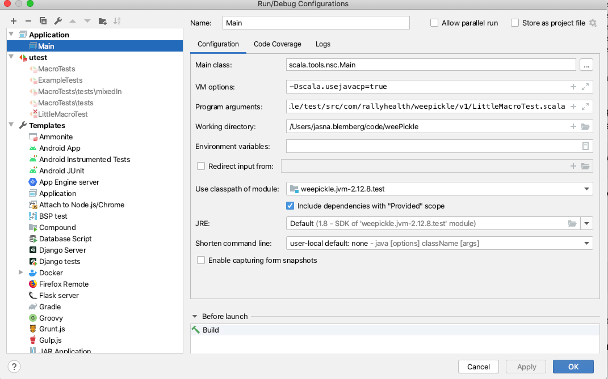

#### Debugging Macros with IntelliJ

##### Compiling Your Test File
 
You'll need to tell IntelliJ how to pick up classpaths. First, run

```shell script
sbt "show weepickle / Compile / dependencyClasspath"
```

After some thinking, sbt should spit out something like this:

```
[
    "ref:fd2319c6:/Users/my.username/code/weePickle/weejson/resources",
    "ref:328a36cb:/Users/my.username/code/weePickle/out/weejson/jvm/2.12.8/compile/dest/classes",
    "ref:c984eca8:/Users/my.username/code/weePickle/core/resources",
    "ref:b270262f:/Users/my.username/code/weePickle/out/core/jvm/2.12.8/compile/dest/classes",
    "ref:c984eca8:/Users/my.username/code/weePickle/weejson/jackson/resources",
    "ref:b780cee7:/Users/my.username/code/weePickle/out/weejson/jackson/2.12.8/compile/dest/classes",
    "ref:c984eca8:/Users/my.username/code/weePickle/implicits/resources",
    "ref:5f140da0:/Users/my.username/code/weePickle/out/implicits/jvm/2.12.8/compile/dest/classes",
    "ref:c984eca8:/Users/my.username/code/weePickle/weepickle/resources",
    "qref:c7bf7188:/Users/my.username/Library/Caches/Coursier/v1/https/repo1.maven.org/maven2/org/scala-lang/scala-compiler/2.12.8/scala-compiler-2.12.8.jar",
    "qref:7706c4e3:/Users/my.username/Library/Caches/Coursier/v1/https/repo1.maven.org/maven2/org/scala-lang/scala-library/2.12.8/scala-library-2.12.8.jar",
    "qref:37b780d0:/Users/my.username/Library/Caches/Coursier/v1/https/repo1.maven.org/maven2/org/scala-lang/modules/scala-xml_2.12/1.0.6/scala-xml_2.12-1.0.6.jar",
    "qref:6fe61ec9:/Users/my.username/Library/Caches/Coursier/v1/https/repo1.maven.org/maven2/com/lihaoyi/acyclic_2.12/0.2.0/acyclic_2.12-0.2.0.jar",
    "qref:ce5c1fb8:/Users/my.username/Library/Caches/Coursier/v1/https/repo1.maven.org/maven2/org/scala-lang/modules/scala-collection-compat_2.12/2.1.2/scala-collection-compat_2.12-2.1.2.jar",
    "qref:88018ad9:/Users/my.username/Library/Caches/Coursier/v1/https/repo1.maven.org/maven2/org/scala-lang/scala-reflect/2.12.8/scala-reflect-2.12.8.jar",
    "qref:784f4e92:/Users/my.username/Library/Caches/Coursier/v1/https/repo1.maven.org/maven2/com/fasterxml/jackson/core/jackson-core/2.10.4/jackson-core-2.10.4.jar"
]
```

In a text editor, copy all of that and remove the `qref:XXXXXXX:` stuff, as well as the `"` double quotes, 
newlines, spaces, and `[]` square brackets. Your end product should look something like this:

```
/Users/my.username/code/weePickle/weejson/resources,/Users/my.username/code/weePickle/out/weejson/jvm/2.12.8/compile/dest/classes,/Users/my.username/code/weePickle/core/resources,/Users/my.username/code/weePickle/out/core/jvm/2.12.8/compile/dest/classes,/Users/my.username/code/weePickle/weejson/jackson/resources,/Users/my.username/code/weePickle/out/weejson/jackson/2.12.8/compile/dest/classes,/Users/my.username/code/weePickle/implicits/resources,/Users/my.username/code/weePickle/out/implicits/jvm/2.12.8/compile/dest/classes,/Users/my.username/code/weePickle/weepickle/resources,/Users/my.username/Library/Caches/Coursier/v1/https/repo1.maven.org/maven2/org/scala-lang/scala-compiler/2.12.8/scala-compiler-2.12.8.jar,/Users/my.username/Library/Caches/Coursier/v1/https/repo1.maven.org/maven2/org/scala-lang/scala-library/2.12.8/scala-library-2.12.8.jar,/Users/my.username/Library/Caches/Coursier/v1/https/repo1.maven.org/maven2/org/scala-lang/modules/scala-xml_2.12/1.0.6/scala-xml_2.12-1.0.6.jar,/Users/my.username/Library/Caches/Coursier/v1/https/repo1.maven.org/maven2/com/lihaoyi/acyclic_2.12/0.2.0/acyclic_2.12-0.2.0.jar,/Users/my.username/Library/Caches/Coursier/v1/https/repo1.maven.org/maven2/org/scala-lang/modules/scala-collection-compat_2.12/2.1.2/scala-collection-compat_2.12-2.1.2.jar,/Users/my.username/Library/Caches/Coursier/v1/https/repo1.maven.org/maven2/org/scala-lang/scala-reflect/2.12.8/scala-reflect-2.12.8.jar,/Users/my.username/Library/Caches/Coursier/v1/https/repo1.maven.org/maven2/com/fasterxml/jackson/core/jackson-core/2.10.4/jackson-core-2.10.4.jar
```

Copy that and paste it as the **Program Arguments** of a new **Run** -> **Edit Configurations** -> 
**+ (Add New Configuration)** ->  **Application** configuration.



At the beginning of the long **Program Arguments** file, add `-cp ` (with a space).


At the end of the string, add a space and then the absolute classpath
of the test file you'll be running and debugging. For example, if I wanted to run `LittleMacroTest.scala`,
my full **Program Arguments** would be like this:

```shell script
-cp /Users/my.username/code/weePickle/weejson/resources,/Users/my.username/code/weePickle/out/weejson/jvm/2.12.8/compile/dest/classes,/Users/my.username/code/weePickle/core/resources,/Users/my.username/code/weePickle/out/core/jvm/2.12.8/compile/dest/classes,/Users/my.username/code/weePickle/weejson/jackson/resources,/Users/my.username/code/weePickle/out/weejson/jackson/2.12.8/compile/dest/classes,/Users/my.username/code/weePickle/implicits/resources,/Users/my.username/code/weePickle/out/implicits/jvm/2.12.8/compile/dest/classes,/Users/my.username/code/weePickle/weepickle/resources,/Users/my.username/Library/Caches/Coursier/v1/https/repo1.maven.org/maven2/org/scala-lang/scala-compiler/2.12.8/scala-compiler-2.12.8.jar,/Users/my.username/Library/Caches/Coursier/v1/https/repo1.maven.org/maven2/org/scala-lang/scala-library/2.12.8/scala-library-2.12.8.jar,/Users/my.username/Library/Caches/Coursier/v1/https/repo1.maven.org/maven2/org/scala-lang/modules/scala-xml_2.12/1.0.6/scala-xml_2.12-1.0.6.jar,/Users/my.username/Library/Caches/Coursier/v1/https/repo1.maven.org/maven2/com/lihaoyi/acyclic_2.12/0.2.0/acyclic_2.12-0.2.0.jar,/Users/my.username/Library/Caches/Coursier/v1/https/repo1.maven.org/maven2/org/scala-lang/modules/scala-collection-compat_2.12/2.1.2/scala-collection-compat_2.12-2.1.2.jar,/Users/my.username/Library/Caches/Coursier/v1/https/repo1.maven.org/maven2/org/scala-lang/scala-reflect/2.12.8/scala-reflect-2.12.8.jar,/Users/my.username/Library/Caches/Coursier/v1/https/repo1.maven.org/maven2/com/fasterxml/jackson/core/jackson-core/2.10.4/jackson-core-2.10.4.jar /Users/my.username/code/weePickle/weepickle/test/src/com/rallyhealth/weepickle/v1/LittleMacroTest.scala
```

Additionally, fill in the rest of this stuff:

- **Main class**: `scala.tools.nsc.Main`
- **VM options**: `-Dscala.usejavacp=true`
- **Use classpath of module**: (Pick your appropriate module)
- **Include dependencies with "Provided" scope"**: (checked)

**Save* that new configuration. Then, select it from the configurations dropdown menu,
and click the **Debug** bug icon.


This will compile your test file in Debug mode. If you already have breakpoints in your 
production code that are touched by your tests, these breakpoints may already begin to 
get triggered.

##### Running Debugger with Your Test File

After your test file's compiled, you can run the test debugger via IntelliJ.

##### Running Single Tests within Multi-test Suite Files

Current hack is to do one of the following:

- Create a temporary new test file with a single test you want to debug
- Comment out all the other tests you're not intersted in within a suite
- Fiddle with old test syntax


##### Gotcha: My code isn't getting picked up by the compiler!

Maybe IntelliJ is being weird. Go back to the Terminal and try running `sbt compile` again.
