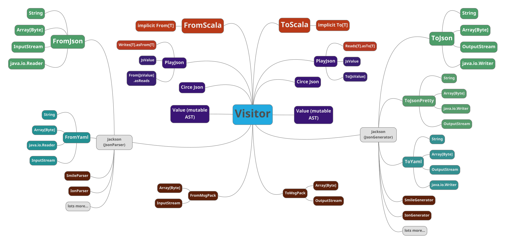

# weePickle [](https://travis-ci.org/rallyhealth/weePickle) [](#sbt)

A *stable* JSON, YAML, MsgPack, XML, etc. serialization framework based on [uPickle](https://com-lihaoyi.github.io/upickle/).

## We're tired of dependency hell!
weePickle exists to fulfill two promises:

1. We will not break compatibility in `v1.x.y`, as enforced by [MiMa](https://github.com/lightbend/mima).
2. When we release `v2.0.0`, you can use it immediately **without waiting for your other library dependencies to update**. We achieve this by [shading](https://github.com/rallyhealth/sbt-shading).

### Shading
Both `weepickle-v1.jar` and `weepickle-v2.jar` (in the future) will coexist on the classpath peacefully by applying [shading](https://github.com/rallyhealth/sbt-shading) at multiple levels.
1. All artifact names are suffixed with the major version number (e.g. `-v1`), which prevents evictions.
2. All packages are prefixed with the major version number (e.g. `com.rallyhealth.v1`), which prevents classpath conflicts.

Shading allows libraries to depend directly on [weePickle-v1](#sbt) without fear of causing incompatible evictions and runtime failures.

For more background, see [shading.md](shading.md).

## Features
weePickle combines some of the best parts of the serialization ecosystem.

- [Zero-overhead conversion of uPickle](http://www.lihaoyi.com/post/ZeroOverheadTreeProcessingwiththeVisitorPattern.html)
- [jackson-core](https://github.com/FasterXML/jackson#active-jackson-projects): async parsing and broad format support (JSON, YAML, XML, CBOR, SMILE, Ion, etc.)
- `case class` support (any number of fields) through customizable macros
- scala json AST interop (circe, json4s, play-json, argonaut)
- Fast serialization to/from [MessagePack](#messagepack)

## sbt
```scala
resolvers += "Rally Health" at "https://dl.bintray.com/rallyhealth/maven"
libraryDependencies += "com.rallyhealth" %% "weepickle-v1" % "version"
```
version: [  ](https://bintray.com/rallyhealth/maven/weePickle/_latestVersion)


## Getting Started
JSON to Scala:
```scala
FromJson("[1,2,3]").transform(ToScala[List[Int]])    ==> List(1, 2, 3)
```

Scala to JSON:
```scala
FromScala(List(1, 2, 3)).transform(ToJson.string)    ==> "[1,2,3]"
```

JSON to pretty JSON:
```scala
FromJson("[1,2,3]").transform(ToPrettyJson.string)   ==>
[
    1,
    2,
    3
]
```

Files & YAML:
#### sbt
```scala
resolvers += "Rally Health" at "https://dl.bintray.com/rallyhealth/maven"
libraryDependencies ++= Seq(
  "com.rallyhealth" %% "weepickle-v1" % "version",
  "com.rallyhealth" %% "weeyaml-v1" % "version"
)
```
```scala
import com.rallyhealth.weejson.v1.yaml.{FromYaml, ToYaml}
import com.rallyhealth.weejson.v1.jackson.FromJson
import java.nio.file.Files
import java.nio.file.Paths

val jsonFile = Files.newInputStream(Paths.get("file.json"))
val yamlFile = Files.newOutputStream(Paths.get("file.yml"))

FromJson(jsonFile).transform(ToYaml.outputStream(yamlFile))
```

Case Classes:
```scala
import com.rallyhealth.weepickle.v1.WeePickle
case class Foo(i: Int)

object Foo {
  implicit val rw = WeePickle.macroFromTo[Foo]
}

FromScala(Foo(1)).transform(ToJson.string)           ==> """{"i":1}"""
FromScala(Foo(1)).transform(ToXml.string)            ==> """<root><i>1</i></root>"""
FromJson("""{"i":1}""").transform(ToScala[Foo])      ==> Foo(1)
```

## Pick Any Two
You can convert directly between any `From`/`To` types. See [Zero-Overhead Tree Processing with the Visitor Pattern](http://www.lihaoyi.com/post/ZeroOverheadTreeProcessingwiththeVisitorPattern.html) for how this works.

The following is a non-exhaustive map of type support:


## Supported Types
- `Boolean`, `Byte`, `Char`, `Short`, `Int`, `Long`, `Float`, `Double`
- `Tuple`s from 1 to 22
- Immutable `Seq`, `List`, `Vector`, `Set`, `SortedSet`, `Option`, `Array`, `Maps`, and all other collections with a reasonable `CanBuildFrom` implementation
- `Duration`, `Either`,
- `Date`, `Instant`, `LocalDate`, `LocalTime`, `LocalDateTime`, `OffsetDateTime`, `ZonedDateTime`
- Stand-alone `case class`es and `case object`s, and their generic equivalents,
- Non-generic `case class`es and `case object`s that are part of a `sealed trait` or `sealed class` hierarchy
- `sealed trait` and `sealed class`es themselves, assuming that all subclasses are picklable
- `UUID`s
- `null`

Readability/writability is recursive: a container such as a Tuple or case class is only readable if all its contents are readable, and only writable if all its contents are writable. That means that you cannot serialize a `List[Any]`, since weePickle doesn't provide a generic way of serializing `Any`.

Case classes are serialized using the `apply` and `unapply` methods on their companion objects. This means that you can make your own classes serializable by giving them companions `apply` and `unapply`. `sealed` hierarchies are serialized as tagged unions: whatever the serialization of the actual object, together with the fully-qualified name of its class, so the correct class in the sealed hierarchy can be reconstituted later.

Anything else is not supported by default, but you can add support using Custom Picklers.

## Defaults
If a field is missing upon deserialization, weePickle uses the default value if one exists.

```scala
case class Dflt(i: Int = 42)

FromJson("""{}""").transform(ToScala[Dflt])          ==> Dflt(42)
FromJson("""{"i": 999}""").transform(ToScala[Dflt])  ==> Dflt(999)
```

If a field at serialization time has the same value as the default, it will be written unless annotated with `@dropDefault`.

```scala
FromScala(Dflt(42)).transform(ToJson.string)         ==> """{"i": 42}"""
```

```scala
case class Dflt2(@dropDefault i: Int = 42)
FromScala(Dflt2(42)).transform(ToJson.string)        ==> """{}"""
```

If a class is annotated with `@dropDefault`, all fields with default values will not be written.

```scala
@dropDefault case class Dflt3(i: Int = 42, j: Int = 43, k: Int = 45)
FromScala(Dflt2(42, 43, 0)).transform(ToJson.string)        ==> """{"k": 0}"""
```

## Options
`Option[T]` is unwrapped when the Option is `Some` ([rationale](differences.md#options)):

```scala
case class Maybe1(i: Option[Int])
object Maybe1 {
  implicit val rw = WeePickle.macroFromTo[Maybe1]
}

FromScala(Maybe1(Some(42))).transform(ToJson.string) ==> """{"i":42}"""
FromJson("""{"i":42}""").transform(ToScala[Maybe1])  ==> Maybe1(Some(42))
```

`None` is translated as `null` ([rationale](differences.md#re-null)):

```scala
FromScala(Maybe1(None)).transform(ToJson.string) ==> """{"i":null}"""
FromJson("""{"i":null}""").transform(ToScala[Maybe1]) ==> Maybe1(None)
FromJson("""{}""").transform(ToScala[Maybe1]) ==> Maybe1(None)
```

If you want to suppress the field entirely on `None`, you can use [Defaults](#Defaults).
```scala
case class Maybe2(@dropDefault i: Option[Int] = None)

FromScala(Maybe2(None)).transform(ToJson.string)     ==> """{}"""
```

But `Option` types are a special case where `None` is an assumed default if a default is not provided explicitly.
So putting `@dropDefault` at the class level will apply to all `Option` types in the class, whether a default is provided explicitly or not.

```scala
@dropDefault case class Maybe3(i: Option[Int], j: Option[Int], k: Option[Int] = Some(0))

FromScala(Maybe3(None, None, Some(0))).transform(ToJson.string)     ==> """{}"""
```

## Custom Keys
weePickle allows you to specify the key with which a field is serialized via a `@key` annotation.

```scala
case class KeyBar(@key("hehehe") kekeke: Int)
object KeyBar{
  implicit val rw = WeePickle.macroFromTo[KeyBar]
}

FromScala(KeyBar(10)).transform(ToJson.string)             ==> """{"hehehe":10}"""
FromJson("""{"hehehe": 10}""").transform(ToScala[KeyBar])  ==> KeyBar(10)
```

## Sealed Hierarchies
Sealed hierarchies are serialized as tagged values, the serialized object tagged with the full name of the instance's class:

```scala
sealed trait Outcome
case class Success(value: Int) extends Outcome
case class DeferredVictory(excuses: Seq[String]) extends Outcome

object Success {
  implicit val rw = WeePickle.macroFromTo[Success]
}
object DeferredVictory {
  implicit val rw = WeePickle.macroFromTo[DeferredVictory]
}
// order matters: the trait's companion object must come at the end for implicit resolution to work
object Outcome {
  implicit val rw = WeePickle.macroFromTo[Outcome]
}

FromScala(DeferredVictory(Seq("My json AST is too slow."))).transform(ToJson.string))  ==>
  """{"$type":"com.example.DeferredVictory","excuses":["My json AST is too slow."]}"""

// You can read tagged value without knowing its
// type in advance, just use type of the sealed trait
FromJson("""{"$type":"com.example.Success","value":42}""").transform(ToScala[Outcome]) ==> Success(42)
```

You can customize the `"$type"` key and values with annotations:
```scala
@discriminator("flavor")
sealed trait Outcome

@key("s")
case class Success(value: Int) extends Outcome

@key("dv")
case class DeferredVictory(excuses: Seq[String]) extends Outcome

FromScala(Success(42)).transform(ToJson.string)      ==> """{"flavor":"s",value:42}""" 
```

## Enumerations
```scala
object Suit extends Enumeration {
  val Spades = Value("Spades")
  val Hearts = Value("Hearts")
  val Diamonds = Value("Diamonds")
  val Clubs = Value("Clubs")

  implicit val pickler = WeePickle.fromToEnumerationName(this)
}

FromScala(Suit.Spades).transform(ToJson.string)         ==> """"Spades""""
FromJson(""""Spades"""").transform(ToScala[Suit.Value]) ==> Suit.Spades
```

## jackson-core
weePickle leans heavily on [jackson-core](https://github.com/FasterXML/jackson-core) for interop with JSON, YAML, and most other formats. [Jackson-databind](https://github.com/FasterXML/jackson-databind) is not used.

### Motivations
1. jackson-core's JSON support is mature, widely used, and heavily optimized.
2. The ecosystem of possible formats is huge: https://github.com/FasterXML/jackson#active-jackson-projects
3. jackson-core has a solid track record of backward compatibility.

### Buffer pooling
Internally, jackson-core uses buffer pooling to achieve some of its performance. Buffers return to the pool after calling `close()` on the underlying Parser/Generator. If this doesn't happen, new buffers get allocated for each message, and performance suffers slightly.

`FromJson` doesn't trust you and calls `close()` automatically after writing a single [json text](https://tools.ietf.org/html/rfc7159#section-2), which covers the vast majority of use cases. If you're working with multiple json texts separated by whitespace, jackson can handle it, but you have to drop down below the high level API and remember to close the parser/generator yourself.

## Value AST
WeePickle includes its own AST named `Value`, largely unchanged from the upstream [uJson](http://www.lihaoyi.com/upickle/#uJson).

```scala
val obj = Obj(
  "foo" -> Arr(
    42,
    "omg",
    true
  )
)

obj("foo")(0).num                  ==> 42

obj.toString                       ==> """{"foo":[42,"omg",true]}"""
obj.transform(ToPrettyJson.string) ==>
  """{
    "foo": [
      42,
      "omg",
      true
    ]
  }"""

FromJson("""{"foo":[42,"omg",true]}""").transform(Value) ==> obj
```

See:
- http://www.lihaoyi.com/upickle/#uJson
- http://www.lihaoyi.com/post/uJsonfastflexibleandintuitiveJSONforScala.html

## MessagePack
weePack is weePickle's [MessagePack](https://msgpack.org/index.html) implementation, largely unchanged from the upstream [uPack](http://www.lihaoyi.com/upickle/#uPack).

### sbt
```scala
resolvers += "Rally Health" at "https://dl.bintray.com/rallyhealth/maven"
libraryDependencies += "com.rallyhealth" %% "weepack-v1" % "version"
```
version: [  ](https://bintray.com/rallyhealth/maven/weePickle/_latestVersion)

### Benchmarks
`FromMsgPack`/`ToMsgPack` perform exceptionally well under benchmarks, yielding higher throughput than JSON or the official [jackson-dataformat-msgpack](https://github.com/msgpack/msgpack-java/blob/develop/msgpack-jackson/README.md).

#### ParserBench
java 11:
```
Benchmark                    Mode  Cnt    Score    Error  Units
ParserBench.jsonBytes       thrpt   15  245.665 ±  3.202  ops/s
ParserBench.jsonString      thrpt   15  213.312 ±  5.250  ops/s
ParserBench.msgpackJackson  thrpt   15  205.738 ±  2.789  ops/s
ParserBench.msgpackScala    thrpt   15  422.313 ± 17.172  ops/s
ParserBench.smile           thrpt   15  271.947 ±  1.116  ops/s
```

#### GeneratorBench
java 11:
```
Benchmark                       Mode  Cnt    Score    Error  Units
GeneratorBench.jsonBytes       thrpt   15  238.335 ± 11.777  ops/s
GeneratorBench.jsonString      thrpt   15  240.125 ±  7.871  ops/s
GeneratorBench.msgpackJackson  thrpt   15  181.195 ±  5.774  ops/s
GeneratorBench.msgpackScala    thrpt   15  304.540 ±  2.225  ops/s
GeneratorBench.smile           thrpt   15  306.462 ±  3.134  ops/s
```

## Limitations
- ScalaJS is not supported (jackson-core is java-only)
- Same macro limitations as [uPickle](https://com-lihaoyi.github.io/upickle/#Limitations)
- XML support is still rudimentary and contributions are welcome.

## Developing
See [developing.md](developing.md) for building, testing, and IDE support.

## Upstream

uPickle: a simple Scala JSON and Binary (MessagePack) serialization library

- [Documentation](https://lihaoyi.github.io/upickle)
- [Project root](https://github.com/lihaoyi/upickle)

If you use uPickle/weePickle and like it, please support it by donating to lihaoyi's Patreon:

- [https://www.patreon.com/lihaoyi](https://www.patreon.com/lihaoyi)
